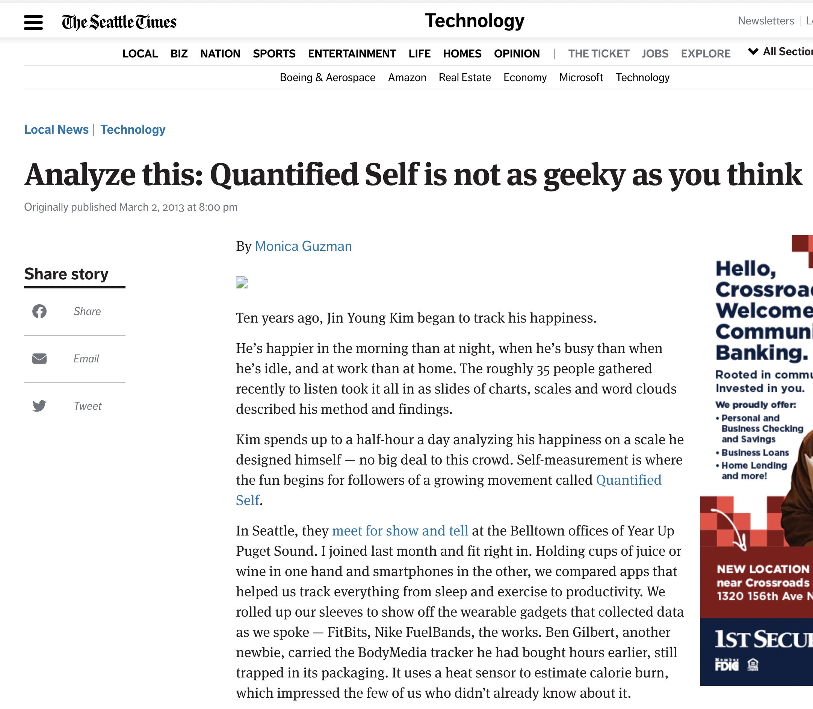
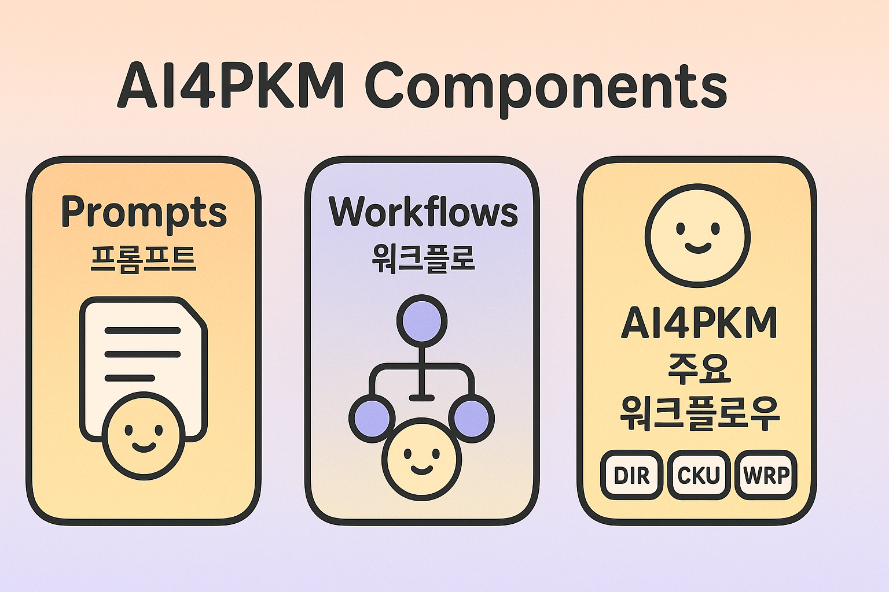
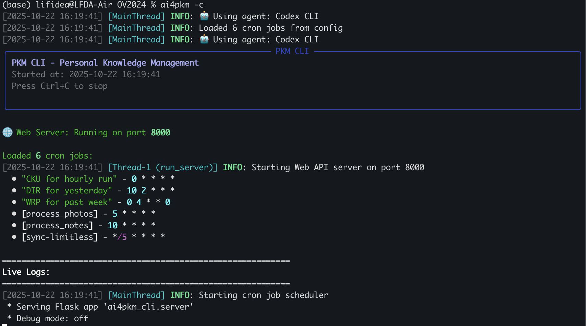
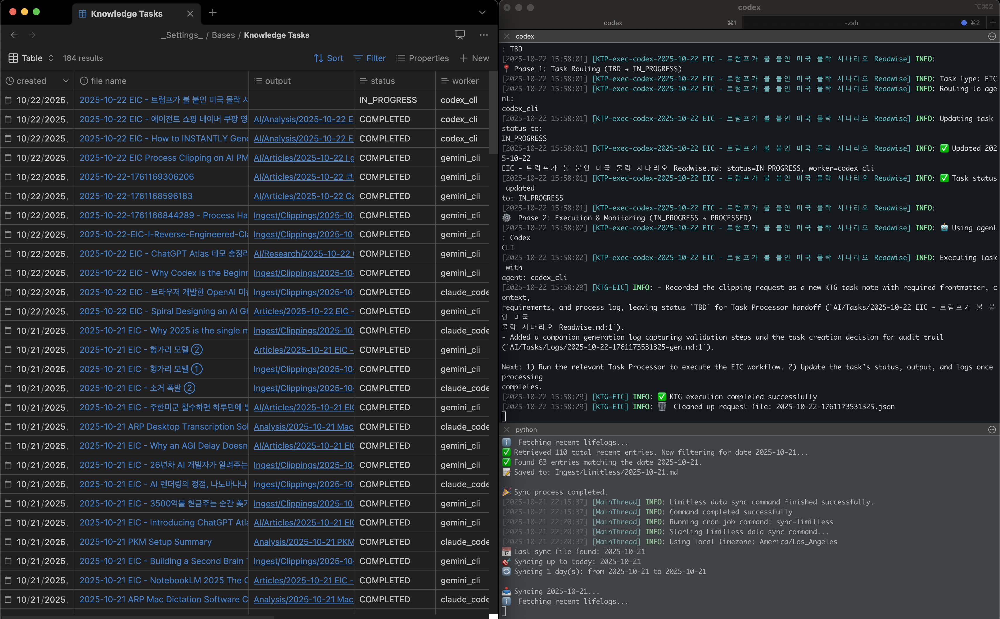
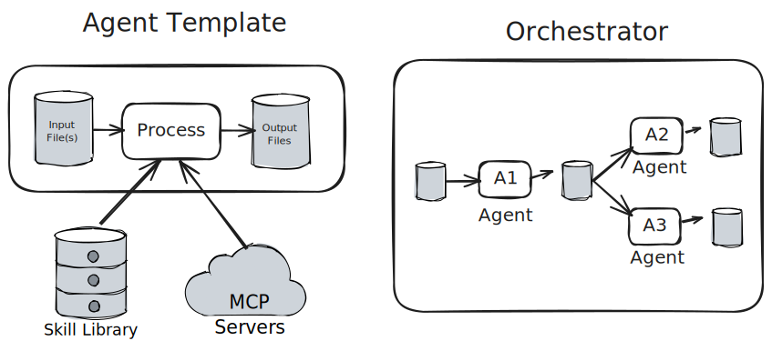

# AI4PKM: Agentic Future for PKM
**관련 정보 모음.zip**: https://tinyurl.com/AI4PKM

^ 안녕하세요. AI for Knowledge Work 프로젝트를 통해 PKM과 AI 에이전트를 결합하는 실험을 하고 있는 김진영입니다. 오늘은 AI4PKM의 미래, 특히 에이전틱 AI가 어떻게 개인 지식 관리를 혁신하는지 알아보겠습니다.

---

## 👤 Speaker Bio
**김진영 (JY Kim)**

- (전) Microsoft/Snap Data Scientist
- (현) Naver US (Director)

^ 저는 Microsoft, Snap에서 데이터 사이언티스트로 일했고, 현재는 Naver US에서 Director로 근무하고 있습니다. AI for Knowledge Work라는 개인 프로젝트를 통해 PKM과 AI 에이전트를 결합하는 다양한 실험을 하고 있습니다.

---

**저는 20대 때부터 각종 데이터를 모아서 분석하는 취미를 가졌습니다**

- 이를 위해 각종 웹/모바일 앱 개발
- 행복 측정 10년 (헬로 데이터 과학)
- AI가 이 과정을 도와주지 않을까?

^ 저는 예전부터 데이터를 수집하고 분석하는 것을 좋아했습니다. 이를 위해 직접 웹과 모바일 앱을 개발했는데, 개발과 분석 과정에서 많은 시간이 들었습니다. AI가 이런 과정을 도와줄 수 있지 않을까 하는 생각에서 이 프로젝트를 시작하게 되었습니다.

---
### Main Collaborator: Minsuk Kang (Gobi CEO)
Gobi: Ambient AI Company (https://www.weargobi.com/)

^ 개발 관련해서는 Gobi의 강민석님과 협업하고 있습니다.

---

# 1. AI for Knowledge Work 🤖

^ 본격적으로 AI for Knowledge Work 프로젝트에 대해 소개하겠습니다. 이 프로젝트는 AI를 활용해 지식 업무를 혁신하는 것을 목표로 합니다.

---

## 📦 Project Vision

**AI기반 PKM 플랫폼을 통해 다양한 지식 업무 지원 **

1. 🏗️ **PKM 플랫폼** - 다양한 지식 업무를 지원하는 기반
2. 🎯 **도메인별 스킬 & 워크플로우** - PKM 위에 구축된 특화 기능

^ AI for Knowledge Work는 두 가지 핵심 구성요소로 이루어집니다. 첫째는 다양한 지식 업무를 지원하는 PKM 플랫폼이고, 둘째는 그 위에 구축된 도메인별 특화 스킬과 워크플로우입니다.

---

# 2. AI for PKM (Platform) 🏗️

**🛠️ 에이전틱 AI 솔루션의 세 가지 핵심 요소:**

1. 📁 사람 사용자를 위한 파일시스템 기반 PKM (Obsidian)
2. 🤖 AI 레이어: 파일시스템 기반 에이전틱 AI (Claude Code / Cursor)
3. 🤝 효율적인 감독과 피드백을 위한 인간-AI 협업 워크플로우

^ 지식 업무를 위한 에이전틱 AI 솔루션의 세 가지 핵심 구성요소입니다. 인간을 위한 PKM 시스템, AI를 위한 에이전틱 시스템, 그리고 둘 사이의 효율적인 협업 체계가 필요합니다.

---

## 🏛️ AI4PKM 전체 아키텍처

^ 이 다이어그램이 전체 아키텍처를 보여줍니다. 왼쪽에는 사용자를 위한 PKM 시스템이 있고, 오른쪽에는 AI를 위한 에이전틱 시스템이 있습니다. 중간에 파일시스템을 공유하면서 각자의 역할을 수행하고, 효율적으로 협업할 수 있는 구조를 만들어냅니다.

---

# 3. AI4PKM Components

^ 이제 AI4PKM의 핵심 구성요소들을 자세히 살펴보겠습니다.

---
## 📝 Prompts
**🧱 PKM 워크플로우의 빌딩 블록**
- 실행과 평가의 단위
- 명확하게 정의된 입력과 출력
- 입력과 출력 개수에 따라: 1:1 / 1:N / N:1 / N:N

^ 에이전틱 AI에서 프롬프트는 단순한 질문이 아닙니다. 마치 프로그래밍의 함수처럼 명확한 입력과 출력이 정의된 재사용 가능한 모듈입니다. 이렇게 설계해야 AI가 자동으로 작업을 연결하고 평가할 수 있습니다.

---

## 🔗 Workflows

**프롬프트를 이어 워크플로우 구성**

예시: Daily Roundup (DIR)
오늘 읽은 글 요약 → Daily Roundup 생성 → Thread 포스팅

^ 여러 프롬프트를 연결하면 강력한 워크플로우가 됩니다. 오늘 읽은 글을 요약하고, 데일리 라운드업을 생성한 뒤, Thread에 포스팅하는 식으로 복잡한 작업을 자동화할 수 있습니다. 각 단계를 병렬로 실행하거나 서로 다른 AI 에이전트에게 맡겨 효율성을 극대화할 수 있습니다.

---

## 📋 AI4PKM 주요 워크플로우

**세 가지 핵심 배치 워크플로우:**
- 📥 **DIR (Daily Ingestion & Roundup)** - 일일 컨텐츠 수집 및 정리
- 🔄 **CKU (Continuous Knowledge Upkeep)** - 지속적 지식 업데이트
- 📊 **WRP (Weekly Roundup & Planning)** - 주간 회고 및 계획

^ AI4PKM의 핵심은 세 가지 배치 워크플로우입니다. DIR은 매일 컨텐츠를 수집하고 정리하고, CKU는 지속적으로 지식을 업데이트하며, WRP는 주간 단위로 회고와 계획을 수행합니다.

---

## 💻 Batch Workflow 실행 화면
CLI 툴을 통해 지정된 시간/주기로 자동 실행 지원

^ 이것이 실제 배치 워크플로우 실행 화면입니다. 커맨드라인에서 각 워크플로우를 실행하고 결과를 확인할 수 있습니다.

---

## ⚡ On-Demand Task Execution

**온디맨드 처리 시스템**
- 실시간 사용자 요청 처리
- 미리 정해지지 않은 작업량 (임시 연구)
- 태스크 큐에서 단위 지식 태스크(UKT) 처리

**주요 구성요소:**
- 🎯 Knowledge Task Generator (KTG)
- ⚡ Knowledge Task Processor (KTP)
- ✅ 태스크 평가 및 품질 관리

^ 배치 처리뿐만 아니라 실시간 온디맨드 처리도 필요합니다. "지금 당장 이 주제에 대해 연구해줘"라는 요청이나 갑자기 떠오른 아이디어에 대한 즉시 연구가 필요할 때 태스크 큐 시스템을 통해 처리합니다.

---

### 🔄 Task Processing Flow

^ 확장 가능한 구조로, 작업이 많아지면 여러 프로세서를 동시에 실행하거나 특정 유형에 특화된 프로세서를 만들 수 있습니다.

---

### 📊 Task Management 데모

^ 이 화면의 왼쪽은 AI가 완료한 지식 테스크를 한눈에 확인할 수 있는 상황판을 보여주고, 오른쪽은 AI가 현재 처리 중인 지식 테스크의 처리 상황을 보여줍니다.

---
### Multi-agent Future
**User-defined Agents**
- Input / Output Specification
- Internal Processing
	- (Local) Skills
	- (Remote) MCP Tools

**Central Orchestrator**
- File system monitoring
- Agent spawning & monitoring
- Agent output evaluation
- Workflow optimization

---

## 🎓 Agent Skills

**Skills: 새로운 추상화 레이어:**
- 현재 AGENTS.md 파일에 여러 Workflow가 공유하는 스킬이 정의됨
  - 예) 옵시디언 링크 및 Frontmatter 작성 원칙
- 향후 개별 Skill 및 관련 도구를 별도의 파일로 옮겨 전문화 예정

^ Claude Skills는 AI를 위한 표준 운영 절차입니다. 현재는 AGENTS.md에 공통 스킬을 정의하고 있지만, 향후에는 각 스킬을 독립적인 파일로 분리하여 재사용성과 전문성을 높일 계획입니다.

---

## 📦 대표 Skill 예시

**도메인별 특화 스킬:**
- 📥 **컨텐츠 수집**: Clippings, Limitless, Photolog 처리
- 📤 **퍼블리싱**: Substack, Thread, LinkedIn 채널별 포맷
- 🗂️ **지식 조직화**: Topic 업데이트, Wiki 링크 검증
- 📝 **Obsidian 규칙**: 링크 포맷, 폴더 구조, Property 표준

^ 각 도메인별로 특화된 스킬을 개발하면 워크플로우의 재사용성이 높아집니다. 컨텐츠 수집부터 퍼블리싱, 지식 조직화, Obsidian 규칙까지 각 영역에 맞는 전문 스킬을 만들어 일관된 품질을 유지할 수 있습니다.

---

# 4. Lessons in Building AI4PKM 📚

^ AI4PKM을 구축하면서 배운 중요한 교훈들을 공유하겠습니다.

---

## 🎯 Human-in-the-Loop Automation

**스크립트 / 에이전트 / 인간의 역할 분담:**

| 역할           | 책임                         |
| ------------ | -------------------------- |
| 🛠️ **스크립트** | 반복 루틴을 스크립트로 자동화하여 노이즈 제거  |
| 🤖 **에이전트**  | 요약, 판단, 적응이 필요한 고가치 작업에 집중 |
| 👤 **인간**    | 정책과 품질 기준으로 전 과정 모니터링      |

^ 스크립트, 에이전트, 인간의 역할을 명확히 나눠야 효율적입니다. 스크립트는 반복 작업을 처리하고, 에이전트는 판단이 필요한 고가치 작업에 집중하며, 인간은 전체 프로세스를 감독합니다. 에이전트만 쓰면 비용이 많이 들고 신뢰성이 떨어지므로, 이렇게 역할을 분담하는 것이 핵심입니다. 

---

## 🔁 Multi-Agent

**안전망 구축 전략:**

- 🔁 한 에이전트의 출력을 다른 에이전트가 교차 평가
- 🧬 이종/멀티 에이전트를 병렬 실행해 품질과 비용 최적화
- ⚠️ 중요 태스크는 중복 배정해 컨텍스트 누락과 오류 완화

^ 멀티 에이전트 평가는 컨텍스트 오버플로를 줄이고 최고 결과를 선택하게 해줍니다. 적어도 한 에이전트가 품질을 검수하게 하면 오류를 조기에 차단할 수 있습니다.

---

# 7. Future of AI4PKM 🚀

^ 마지막으로 AI4PKM의 미래에 대해 이야기하겠습니다.

---

## 🔮 세 가지 미래 발전 방향

1. 🤖 **Self-Improving Systems** - 자동 개선 워크플로우
2. 📱 **Always-On Agents** - 클라우드 기반 AI 어시스턴트
3. ⚖️ **Open vs Closed Ecosystems** - 생태계 선택

^ AI4PKM의 미래는 세 가지 방향으로 발전할 것입니다. 자동으로 개선되는 시스템, 언제나 사용 가능한 에이전트, 그리고 개방형과 폐쇄형 생태계 중의 선택입니다.

---

## 🤖 Self-Improving Systems

**사람이 쓴 프롬프트 → 자동 개선 워크플로우**

^ 현재 우리가 사용하는 AI 워크플로우는 대부분 정적입니다. 프롬프트를 만들고, 테스트하고, 수동으로 개선하죠. 하지만 미래에는 시스템이 모든 상호작용에서 학습하여 프롬프트와 워크플로우를 자동으로 개선할 것입니다.

---

## 📱 Always-On Agents

**클라우드 기반 AI 어시스턴트**
**핵심 기능:**
- 언제 어디서나 접근 가능
- 음성 우선 인터페이스
- 모바일 완전 지원
- Ambient Capture

^ 현재 AI 에이전트는 컴퓨터에 묶여 있습니다. 미래의 AI 에이전트는 클라우드에서 호스팅되어 언제 어디서나 접근 가능하고, 음성 우선 인터페이스로 자연스러운 대화가 가능하며, 모바일에서도 완전한 기능을 제공합니다.

---

## ⚖️ Open vs Closed Ecosystems

**편의성 vs 통제권의 트레이드오프**

^ AI for Knowledge Work가 성숙해지면서 근본적인 선택에 직면하게 됩니다. 폐쇄형 생태계는 매끄러운 경험을 제공하지만 커스터마이징이 제한됩니다. 개방형 생태계는 최대한의 유연성과 데이터 소유권을 제공하지만 기술적 전문성이 필요합니다.

---

## 🚀 AI 배수 효과 극대화하기

**4가지 핵심 전략:**
1. 🤝 **워크스페이스 공유** - AI를 작업 공간의 일부로
2. 📚 **지식 수집 & 정리** - PKM을 통한 개인적 컨텍스트 제공
3. 🔄 **프롬프트 & 워크플로우 재사용** - 성공 패턴의 체계적 관리
4. 🧪 **지속적 실험** - 새로운 도구와 기법에 대한 호기심 유지

^ AI의 배수 효과를 극대화하려면 네 가지 전략이 필요합니다. AI에게 작업 공간을 공유하고, PKM을 통해 개인적 맥락을 제공하며, 성공한 프롬프트와 워크플로우를 재사용하고, 새로운 도구와 기법을 지속적으로 실험해야 합니다.

---

## 💭 AI Agent와 일하면서 느낀 점

**1. 인간 팀원과 매우 비슷함**
- 시간도 오래 걸리고 실수도 하고 거짓말(?)도 하고
- 잘하는 일은 잘하지만 못하는 일은 못함
- 적절한 스콥과 피드백이 좋은 성과에 핵심

**2. 힘들어도 AI를 쓰려고 노력하는 이유**
- 일단 훈련시켜 놓으면 혼자 잘 일함
- AI와 일하는 방법이 생존 스킬이고
- AI는 앞으로 더 싸고 강력해질 테니까

^ 사실 AI와 일하는 것이 생각만큼 쉽지는 않습니다. 다양한 지적 작업을 할 수 있는 만큼 그 역량을 파악하고 성과를 내게 하는데는 그만큼의 노력이 듭니다. 그런 면에서 예전에 인간 팀원과 일할때와 비슷한 부분도 있어요.

---

## 🎯 Questions & Comments?

**실천을 위한 세 가지 질문:**
1. 내 삶과 일에서 어떤 데이터를 더 수집할 수 있을까?
2. 내 업무를 효율화/자동화할 수 있는 Workflow는 무엇일까?
3. 오늘 소개된 AI 도구 중 무엇을 써볼 수 있을까?

**관련 정보 모음.zip**: https://tinyurl.com/AI4PKM

^ 발표를 마치며 세 가지 질문을 드립니다. 여러분의 삶과 일에서 어떤 데이터를 더 수집할 수 있을까요? 어떤 업무를 효율화하고 자동화할 수 있을까요? 그리고 오늘 소개된 AI 도구 중 무엇을 당장 써볼 수 있을까요? 질문이나 의견 있으시면 편하게 말씀해 주세요. 감사합니다.

^ 이제 여러분이 실천할 차례입니다. 작게 시작하되 꾸준히 실험하는 것이 중요합니다. AI4PKM 레포지토리에 모든 자료가 있으니 참고하시기 바랍니다.

---

## 📦 AI4PKM Template + CLI Tool

^ AI4PKM 프로젝트는 바로 설치해 사용해보실수 있는 Obsidian 템플릿과, 다양한 Workflow를 배치/실시간으로 실행할 수 있는 CLI툴을 제공합니다.

---

## 📺 설치 튜토리얼

**Catch Up AI 채널 비디오 (@박창수님)**

^ AI4PKM 설치 튜토리얼은 Catch Up AI 채널을 참고하세요!

---

# 감사합니다! 🙏
