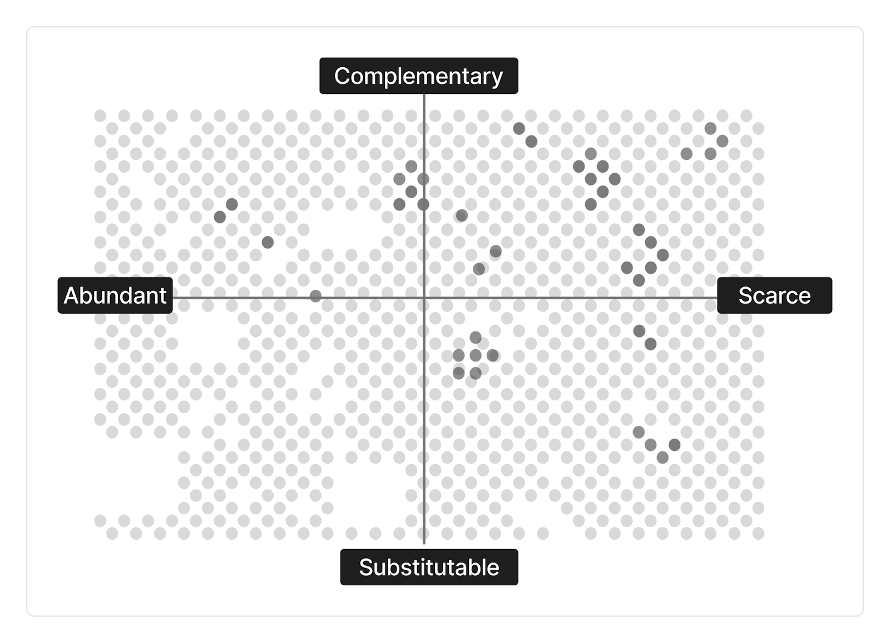

slidenumbers: true

# Thriving in AI Era 🌟

---

## How AI Changes the Game 🎮

**지식 노동의 가치 하락**:
- 보고서 작성
- 프로그래밍
- 디자인

**가속화되는 트렌드**:
- 더 유능한 AI
- 더 저렴한 비용

^ AI는 지식 노동의 판도를 완전히 바꾸고 있습니다. 전통적으로 가치 있던 작업들 - 보고서 작성, 프로그래밍, 디자인 - 의 가치가 급격히 하락하고 있습니다. 그리고 이 트렌드는 AI가 더 유능해지고 저렴해지면서 계속 가속화되고 있죠.

---

## Scarcity vs Complementarity 매트릭스 📊

**우리가 목표해야 할 위치**: 오른쪽 상단
- AI가 쉽게 할 수 없는 일
- AI를 더 유용하게 만드는 일

^ 이 매트릭스에서 우리는 오른쪽 상단 코너를 목표해야 합니다. AI가 대체하는 것이 아니라, AI가 우리의 가치를 증폭시키는 위치 말이죠.

^ **Scarcity(희소성)**: AI가 잘하는 작업의 노동력은 무한히 풍부해져 임금이 하락하고 일자리가 사라집니다. 반대로 자동화가 어려운 기술은 상대적으로 희소해져 가치가 높아집니다.

^ **Complementarity(보완성)**: AI를 더 유용하게 만드는 기술입니다. 프롬프팅, 워크플로우에 AI 통합, AI 결과물 해석과 비판 등. 이런 기술은 AI와 경쟁하지 않고 AI를 강화합니다.

---

## Consequences: 일자리 시장의 변화 📉

**현실**:
- 신입 일자리 감소
- P2P 지식 작업 시장 축소
- 기업들의 채용 감소

^ 이미 변화는 시작되었습니다. 대학 졸업생들이 진입하는 경제는 지난 40년 중 최악입니다. 신입 수준에서 하던 보고서 작성, 데이터 합성 같은 일들을 이제 AI가 대신하기 때문이죠.

---

## Historical Precedence: 역사는 반복된다 🔄

**자동화의 패턴**:
- 자동화가 일상 작업을 처리하면 → 다른 곳에 병목 발생
- 병목을 관리할 새로운 역할 출현
- 부분 자동화는 대개 전체 고용 증가

^ 역사적으로 자동화는 특정 일자리를 없앴지만, 새로운 일자리를 만들어왔습니다. 핵심은 어디에 새로운 병목이 생기고, 어떤 새로운 역할이 필요해지는가를 이해하는 것입니다.

---

## What's Valuable Now? 💎

**더 저렴해진 지능을 활용하는 것**:
- 컨텐츠 생성
- 도메인 특화 컨설팅

**새로운 메타 스킬**:
- 업무 조직화와 우선순위 설정
- 가이던스와 방향 제시
- 개인 상담과 관계
- 불확실성 속 의사결정

^ 기회는 여전히 열려 있지만, 필요한 것들이 바뀌었습니다. 올바른 질문을 하고, AI 워크포스를 관리하며, 가치를 창출하고 전달하는 능력이 중요해졌습니다.

---

## 경량문명과 린 AI 🎯

**린 AI 리더보드**:
- 창업 5년 이내
- 50인 이하
- 500만 달러 이상 매출

**시간의 역전 현상**:
> "최근 설립 기업들이 인력 충원 없이 더 빠르게 성장"

**핵심**: 작은 규모의 모둠으로도 커다란 진보

^ 새로운 성공 패러다임이 등장했습니다. 소수의 인원으로 큰 가치를 만드는 것이 가능해졌죠. 저마다의 지혜가 각자의 인공지능과 결합하여 새로운 문명을 만들어가고 있습니다.

---

## CHRO에서 CTO로 🔄

**패러다임 전환**:
- Chief Human Resource Officer → Chief Task Officer
- 사람 관리 → 일(Task) 관리

**혼합지능 시대**:
- 인공지능
- 인간지능
- 인간+AI 혼합지능

^ 사람을 관리하던 시대에서 일을 관리하는 시대로 전환되고 있습니다. 태스크 관리 부서는 상황에 따라 AI, 사람, 또는 둘의 조합으로 업무를 처리하도록 설계하고 지원합니다.

---

## How to Fail in AI Era ⚠️

**실패 패턴**:
- 조직과 사회에서 외로운 늑대되기
- AI와 함께 일하는 새로운 방법 배우기 실패
- 자격증에만 의존하고 보완 스킬 개발 안함
- AI가 잘하는 작업에서 AI와 경쟁
- AI 도구 실험 거부
- AI가 복제할 수 없는 메타 스킬 개발 안함

^ 이런 실수들을 피해야 합니다. 특히 AI 시대에는 혼자서는 살아남기 어렵습니다. 커뮤니티와 네트워크가 그 어느 때보다 중요해졌죠.

---

# Case for Renaissance Human 🎨

---

## Multipotentialite의 슈퍼파워 ✨

**세 가지 강점**:

1. **아이디어 합성**: 두 개 이상 분야를 결합해 새로운 것 창조
   - 예: Meshu - 지도+데이터 시각화+여행+수학+디자인

2. **빠른 학습**: 새로운 분야를 빠르게 흡수
   - 많은 기술은 분야를 넘나들며 전이됨

3. **적응력**: 상황에 따라 필요한 역할로 변신
   - 21세기 번영을 위한 가장 중요한 단일 기술

> "We have a lot of complex, multidimensional problems in the world right now, and we need creative, out-of-the-box thinkers to tackle them."

^ 에밀리 와프닉의 연구에 따르면, 다재다능한 사람들(multipotentialite)은 AI 시대에 특별한 강점을 가집니다. 여러 분야의 지식을 결합하고, 빠르게 배우며, 상황에 따라 적응하는 능력이죠. 현대 사회의 복잡하고 다차원적인 문제들을 해결하려면 이런 창의적이고 틀 밖의 사고를 하는 사람들이 필요합니다.

---

## Perils of Specialization 📚

**전문화의 함정**:
- 왜 전문화? → 새로운 것 배우기 어려워서
- 전문화는 경계 밖 가치 창출을 어렵게 함
- 하지만 AI 덕분에 그 경계가 훨씬 낮아졌다

**AI 시대의 르네상스형 인재**:
- 다양한 스킬과 영역 학습
- 가치 있는 조합 발견

^ 과거에는 한 분야의 전문가가 되는 것이 안전했습니다. 하지만 AI가 진입 장벽을 낮추면서, 여러 분야를 넘나드는 것이 오히려 경쟁력이 되었습니다.

---

## Why Renaissance Works in AI Era 🚀

**AI가 만드는 새로운 가능성**:
- AI가 새로운 도메인 학습의 장벽을 낮춤
- 여러 스킬의 조합이 독특한 가치 제안 창출
- 솔로 빌더도 복잡한 제품 만들 수 있음
- 도메인 간 인사이트가 경쟁 우위

**T-shaped Professional**:
- Phase 1: 핵심 스킬 클러스터 내에서 폭 넓히기
- Phase 2: 인접 도메인으로 전략적 확장

^ 르네상스형 인재가 AI 시대에 유리한 이유는 명확합니다. AI가 학습과 실행의 장벽을 낮춰주면서, 여러 영역을 넘나들며 독특한 가치를 만드는 것이 가능해졌기 때문입니다.

---

# Case for Creative Community 🤝

---

## What is a Creative Community? 👥

**정의**:
- 크리에이터를 위한 지원 그룹
- 서로를 비평가이자 고객으로 돕기
- 스킬 교환 네트워크

**왜 중요한가**:
- 동료 학습이 성장 가속화
- 템플릿과 워크플로우 공유로 중복 감소
- 커뮤니티 검증이 작동하는 것 식별
- 실험 단계의 상호 지원
- 네트워크 효과가 집단 지성 창출

^ 크리에이티브 커뮤니티는 단순한 모임이 아닙니다. 서로의 성장을 돕고, 지식을 공유하며, 함께 실험하는 생태계입니다.

---

## Perennial Seller 원칙 적용 📘

> "Great marketing can't fix a bad product."

**커뮤니티 구축 4단계**:
1. **제작**: 가치 있는 콘텐츠와 시스템 먼저
2. **포지셔닝**: 명확한 타깃과 메시지
3. **마케팅**: 코어 팬 1,000명 전략
4. **플랫폼**: 이메일 리스트 등 소유 가능한 자산

^ 훌륭한 마케팅도 나쁜 제품을 고칠 수 없듯이, 커뮤니티도 진정한 가치가 있어야 지속됩니다. 먼저 가치를 만들고, 명확히 포지셔닝하고, 코어 팬을 만들고, 소유 가능한 플랫폼을 구축해야 합니다.

---

## Next Steps: Your Action Plan 🎯

**1. 자신의 위치 파악**:
- Scarcity vs Complementarity 매트릭스에서 어디?
- AI가 나의 가치를 증폭시키는가, 대체하는가?

**2. 스킬 조합 발견**:
- 내가 가진 독특한 스킬 조합은?
- 어떤 인접 영역으로 확장할 것인가?

**3. 커뮤니티 찾기 또는 만들기**:
- 함께 성장할 수 있는 동료는?
- 어떤 가치를 서로 교환할 것인가?

^ AI 시대를 살아가는 것은 혼자서는 어렵습니다. 자신의 위치를 파악하고, 독특한 가치를 만들고, 함께 갈 사람들을 찾으세요. 그것이 AI 시대를 thriving하는 비결입니다.
