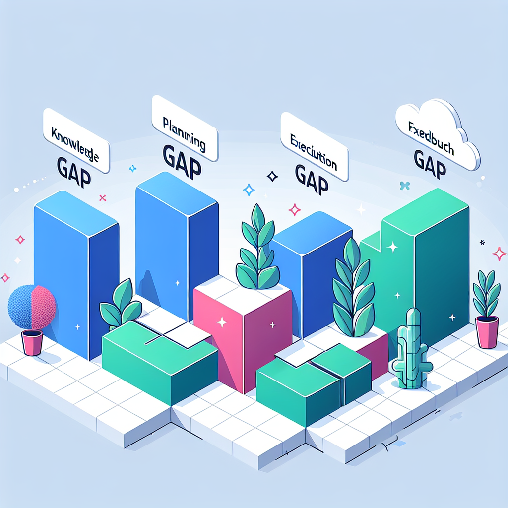
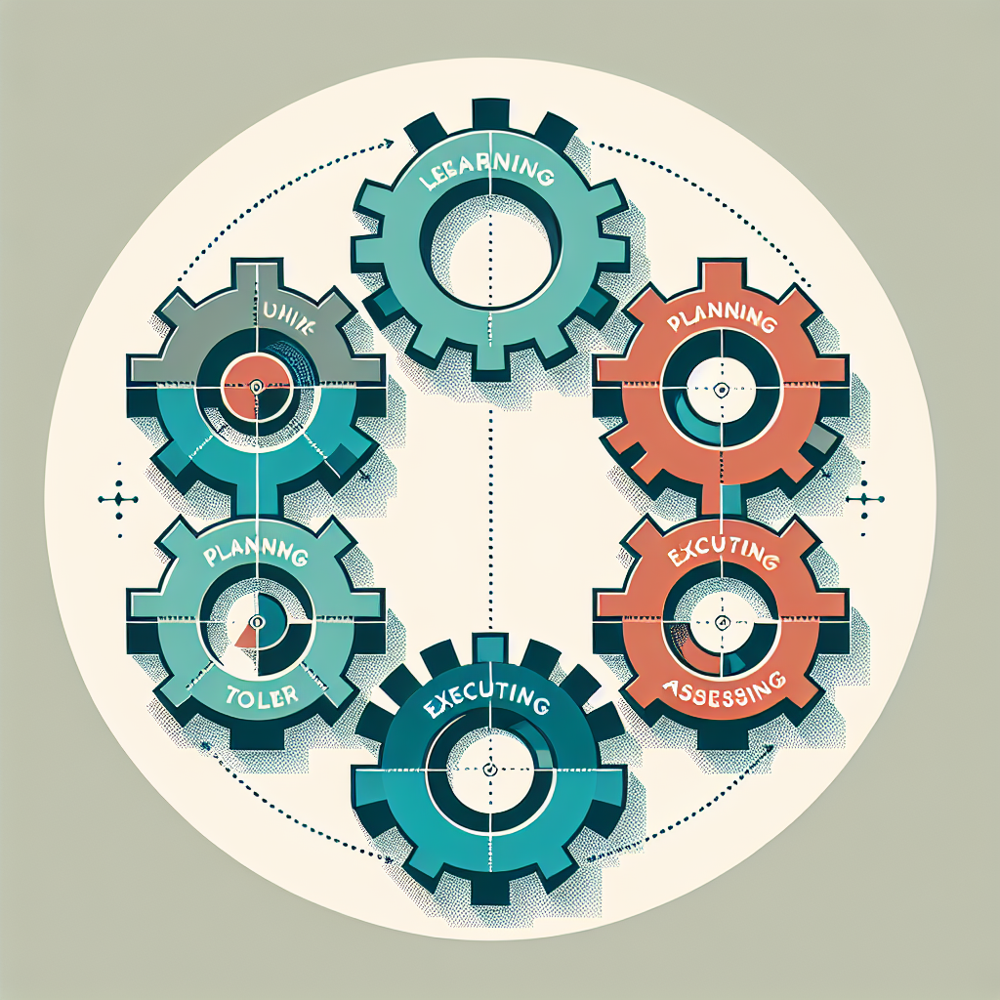
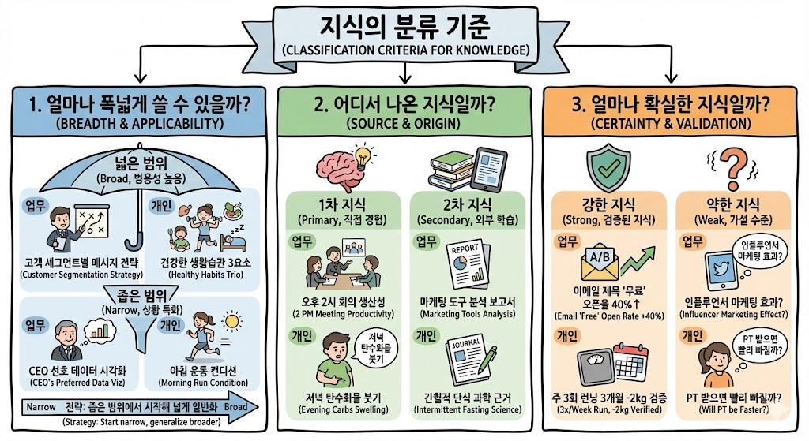
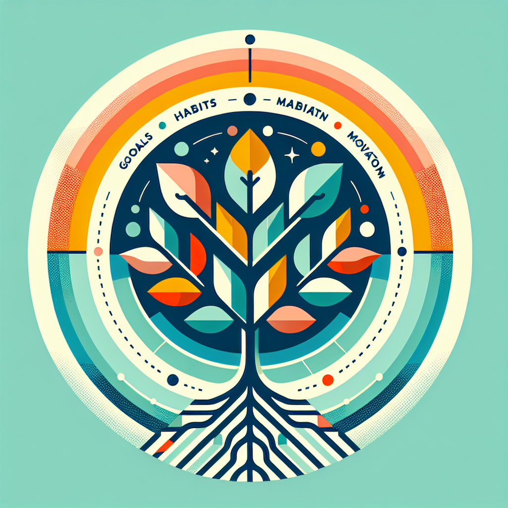
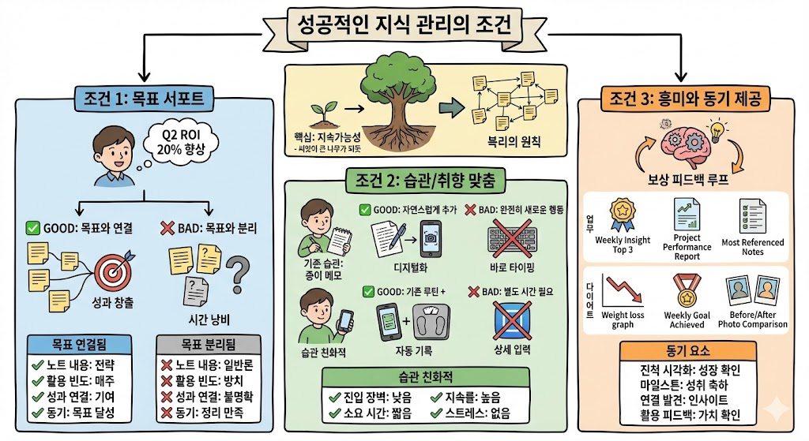
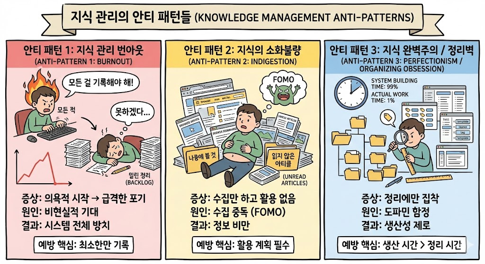

slidenumbers: true

# Why PKM 📚
## Theory of AI4PKM (1)

^ 안녕하세요. 오늘은 AI4PKM 시리즈의 첫 번째 주제, "왜 지식 관리가 필요한가"에 대해 이야기하겠습니다.

---

# 1. 모든 것은 지식의 문제다 🎯

^ 첫 번째 섹션에서는 우리가 직면하는 문제들의 본질이 무엇인지 살펴보겠습니다.

---

## 반복되는 문제들 🔄

- 매주 같은 이슈가 팀 회의에서 논의됨
- 지난 분기 교훈이 공유되지 않아 같은 실수 반복
- 어딘가 기록해뒀는데 필요할 때 찾지 못함
- 같은 정보를 또 검색하는 일 반복

^ 직장과 일상에서 흔히 겪는 문제들을 생각해보세요. 매주 반복되는 팀 회의에서 같은 이슈들이 계속 논의되고, 비슷한 실수들이 반복됩니다. 이런 상황들의 공통점은 무엇일까요?

---

## 핵심 문제 💡

> **지식이 개인과 조직에 제대로 습득 및 축적되지 않는다**

우리가 경험하는 문제들의 대부분은
더 나은 **지식 관리**를 통해 해결하거나 예방할 수 있다.

^ 바로 지식이 제대로 축적되지 않는다는 점입니다. 경험에서 배운 것들이 휘발되고, 다음 번에 같은 상황을 만났을 때 활용되지 못합니다.

---

## 4가지 핵심 격차 📊

1. **지식 격차**: 무엇을 해야 할지 모름
2. **계획 격차**: 어떤 순서로 진행할지 모름
3. **실행 격차**: 실제로 실행할 능력 부족
4. **피드백 격차**: 결과에서 학습하지 못함

^ 예를 들어 새로운 마케팅 캠페인을 시작한다고 합시다. 성공하려면 무엇을 해야 할지 알아야 하고, 어떤 순서로 진행할지 계획해야 하며, 실제로 실행할 수 있는 능력이 있어야 하고, 결과를 보고 다음에 더 잘할 수 있도록 학습해야 합니다.

---

## 업무 vs 개인 사례 비교 📋

| 문제 유형 | 마케팅 캠페인 | 다이어트 |
|----------|-------------|---------|
| 지식 부족 | 트렌드를 따라가지 못함 | 식단 구성법을 모름 |
| 계획 부족 | 우선순위 정하지 못함 | 운동 스케줄 못 잡음 |
| 실행 부족 | 구체적 실행 방법 모름 | 헬스장 등록만 하고 안 감 |
| 피드백 부족 | 결과 분석하지 않음 | 왜 실패했는지 모름 |

^ 이 4가지 격차는 업무에서든 개인 생활에서든 동일하게 적용됩니다. 마케팅 캠페인이든 다이어트든, 지식-계획-실행-피드백의 연결고리가 끊어지면 같은 실패를 반복하게 됩니다.

---

# 2. 지식 관리는 어떻게 작동할까? ⚙️

^ 이제 지식 관리가 실제로 어떻게 작동하는지 살펴보겠습니다.

---

## 지식 관리 사이클 🔄

지식 관리는 결국:

**배우고 → 계획하고 → 실행하고 → 결과를 평가하는**

사이클을 최적화하는 것

^ 지식 관리 관점에서 분석해보면, 이것은 배우고, 계획하고, 실행하고, 결과를 평가하는 사이클을 최적화하는 것입니다. 이 사이클이 잘 돌아가야 지속적인 성장이 가능합니다.

---

## 모든 요소의 기록 📝

성공적인 지식 관리를 위해서는 **모든 요소가 빠짐없이 기록**되어야 한다:

| 요소 | 마케팅 캠페인 | 다이어트 |
|-----|-------------|---------|
| 지식 | 고객 분석, 업계 트렌드 | 운동/영양학 정보 |
| 정보 | 경쟁사 자료, 과거 데이터 | 현재 체중, 기초대사량 |
| 행동 | 광고 집행, 콘텐츠 제작 | 매일의 식단과 운동 |
| 결과 | 클릭률, 전환율, ROI | 주간 체중/체지방 변화 |

^ 단순히 "캠페인을 실행했다"는 기록만으로는 부족합니다. 어떤 지식을 바탕으로, 어떤 정보를 수집했으며, 구체적으로 어떤 행동을 취했고, 그 결과가 어떠했는지를 모두 연결해서 기록해야 다음에 개선할 수 있습니다.

---

## 연결의 중요성 🔗

지식 → 정보 → 행동 → 결과의 흐름이
**끊기지 않고 유기적으로 연결**되어야 한다

- 업계 트렌드 (지식)
- 경쟁사 분석 자료 (정보)
- 실제 광고 집행 (행동)
- 성과 측정 (결과)

**이 중 하나라도 빠지면 같은 실수를 반복**

^ 이 연결고리가 끊어지면 과거의 경험에서 배우지 못하고 같은 실수를 반복하게 됩니다. 지식 관리의 핵심은 이 연결을 유지하는 것입니다.

---

# 3. 지식 관리의 구성요소 🧩

^ 이제 우리가 다루는 정보들을 어떻게 분류하고 관리할 수 있는지 살펴보겠습니다.

---

## 하루 동안 다루는 정보들 📅

마케팅 부서 직원의 하루:

- **오전 9시**: 팀 회의에서 신제품 런칭 계획 논의
- **오전 11시**: 마케팅 트렌드 관련 기사 읽음
- **오후 2시**: 고객 피드백 이메일 확인
- **오후 4시**: 경쟁사 분석 보고서 검토
- **오후 6시**: 오늘의 성과와 내일 계획 정리

^ 하루 동안 우리가 다루는 정보는 엄청나게 다양합니다. 회의록, 이메일, 보고서, 업계 뉴스, 고객 피드백 등 형태도 다르고 출처도 제각각입니다.

---

## 정보의 세 가지 유형 📂

### 1️⃣ 일정과 경험 중심의 정보

**시간과 장소에 연결된 정보**

- 회의록: "2024년 Q1 마케팅 전략 회의"
- 프로젝트 메모: "A 캠페인 진행 상황"
- 개인 회고: "오늘 프레젠테이션 피드백"

^ 첫 번째는 일정과 경험 중심의 정보입니다. 이런 정보들은 특정 시점의 상황을 기록하는 성격이 강하며, 나중에 패턴을 발견하거나 경험을 성찰할 때 유용합니다.

---

## 정보의 세 가지 유형 📂

### 2️⃣ 대화와 소통 정보

**관계의 맥락과 소통의 히스토리**

- 고객 피드백: "B2B 고객 김사장님 기능 개선 요청"
- 팀 내 소통: "디자이너 박씨가 제안한 새로운 컬러"
- 업계 네트워킹: "마케팅 세미나에서 만난 이대리"

^ 두 번째는 대화와 소통 정보입니다. 향후 유사한 상황에서 참고할 수 있는 실용적 가치를 갖습니다.

---

## 정보의 세 가지 유형 📂

### 3️⃣ 출판물에서 습득한 정보

**외부 소스에서 얻은 간접 경험**

- 업계 트렌드: "2024 마케팅 트렌드 - AI 개인화"
- 경쟁사 분석: "C사 신제품 런칭 전략"
- 스킬 학습: "효과적인 이메일 마케팅 작성법"

^ 세 번째는 출판물에서 습득한 정보입니다. 이들은 반드시 자신의 상황에 맞게 해석하고 적용하는 과정을 거쳐야 진정한 지식이 됩니다.

---

## 정보 유형 요약 📊

^ 이 다이어그램은 세 가지 정보 유형을 한눈에 보여줍니다. 일정과 경험 중심의 정보, 대화와 소통 정보, 그리고 출판물에서 습득한 정보로 구분됩니다.

---

## 지식의 분류 기준 📐

### 1️⃣ 범용성: 얼마나 폭넓게 쓸 수 있을까?

| 넓은 범위 (범용성 높음) | 좁은 범위 (상황 특화) |
|----------------------|-------------------|
| "고객별 메시지 차별화 전략" | "우리 CEO가 선호하는 스타일" |
| 모든 캠페인에 적용 가능 | 특정 상황에서만 유용 |

**전략**: 좁은 범위 → 넓은 범위로 일반화

^ 정보를 지식으로 변환할 때 첫 번째 기준은 범용성입니다. 좁은 범위의 지식에서 시작해 점차 넓은 범위로 일반화하는 것이 효과적입니다.

---

## 지식의 분류 기준 📐

### 2️⃣ 출처: 어디서 나온 지식일까?

| 1차 지식 (직접 경험) | 2차 지식 (외부 학습) |
|--------------------|-------------------|
| "우리 팀은 오후 2시 이후 회의가 생산적" | "마케팅 자동화 도구 비교 분석" |
| "나는 탄수화물 저녁에 먹으면 붓는다" | "간헐적 단식의 과학적 근거" |

^ 두 번째 기준은 출처입니다. 직접 경험으로 얻은 1차 지식과 외부 학습을 통한 2차 지식으로 구분할 수 있습니다.

---

## 지식의 분류 기준 📐

### 3️⃣ 확실성: 얼마나 검증된 지식일까?

| 강한 지식 (검증됨) | 약한 지식 (가설 수준) |
|------------------|-------------------|
| "이메일 제목에 '무료' 포함시 오픈율 40% 증가" (A/B 테스트 3회) | "인플루언서 마케팅이 효과적일 것" (아직 시도 안 함) |

^ 세 번째 기준은 확실성입니다. 실제 경험을 통해 검증된 강한 지식과 아직 가설 수준인 약한 지식을 구분해야 합니다.

---

## 지식 분류 기준 요약 📐

^ 이 다이어그램은 지식을 분류하는 세 가지 기준을 요약합니다. 범용성, 출처, 그리고 확실성으로 지식을 체계적으로 분류할 수 있습니다.

---

## 지식 계층 구조 🏗️

^ 이 세 가지 기준으로 지식을 분류하면 체계적인 지식 계층 구조를 만들 수 있습니다.

---

# 4. 성공적인 지식 관리의 조건 ✅

^ 이제 지식 관리가 성공하기 위한 조건들을 살펴보겠습니다.

---

## 핵심 조건: 지속가능성 🌱

> 마치 씨앗이 발아해 묘목이 되고 큰 나무가 되듯,
> 지속 가능한 지식 관리만이 평생 가는 동반자

**복리의 원칙이 지식 관리에도 적용된다**

1년차: 100개 노트
2년차: 200개 + **기존 노트와의 연결** = 기하급수적 가치 증가

^ 성공적인 지식 관리의 가장 중요한 조건은 지속가능성입니다. 복리의 원칙이 지식 관리에도 적용됩니다. 지식이 쌓이면 더 풍부한 연결을 맺을 수 있고, 그 연결이 또 새로운 지식에 대한 영감을 줍니다.

---

## 조건 1: 목표 서포트 🎯

지식 관리 시스템 자체가 목표가 되어서는 안 된다

| 상태 | 목표 연결됨 | 목표 분리됨 |
|-----|-----------|-----------|
| 노트 내용 | "Q2 캠페인 A/B 테스트 전략" | "마케팅 일반론 정리" |
| 활용 빈도 | 매주 참조 | 한 번 쓰고 방치 |
| 성과 연결 | 캠페인 성과 향상 | 기여도 불명확 |

^ 첫 번째 조건은 사용자의 목표를 서포트해야 한다는 것입니다. 완벽하게 정리된 노트 시스템이 있어도 실제 성과로 이어지지 않으면 의미가 없습니다.

---

## 조건 2: 습관 친화 🏃

아무리 좋은 시스템도 **자연스러운 흐름에 맞지 않으면** 오래 유지 불가

| 습관 친화적 | 습관 충돌 |
|-----------|----------|
| 기존 행동에 자연스럽게 추가 | 완전히 새로운 행동 요구 |
| 기존 루틴 + 1-2분 | 별도로 15-30분 필요 |
| 3개월 후에도 유지 | 2주 만에 포기 |

^ 두 번째 조건은 사용자의 습관과 취향에 맞아야 한다는 것입니다. 새로운 습관을 만드는 것보다 기존 습관에 시스템을 녹이는 것이 훨씬 효과적입니다.

---

## 조건 3: 흥미와 동기 💪

장기적인 지속을 위해서는 **보상 피드백 루프** 필요

| 동기 요소 | 업무 예시 | 다이어트 예시 |
|----------|----------|-------------|
| 진척 시각화 | 지식 그래프 크기 변화 | 체중 감소 그래프 |
| 마일스톤 | "100번째 노트 달성!" | "첫 5kg 달성!" |
| 연결 발견 | 과거 메모가 현재 문제 해결 | 3개월 전 습관의 효과 확인 |

^ 세 번째 조건은 꾸준한 흥미와 동기를 제공해야 한다는 것입니다. 노력에 대한 가시적인 성과를 확인할 수 있어야 계속할 동기가 생깁니다.

---

## 성공 조건 요약 ✅

^ 이 다이어그램은 성공적인 지식 관리의 세 가지 핵심 조건을 요약합니다. 목표 서포트, 습관 친화, 그리고 흥미와 동기가 모두 충족되어야 지속 가능한 지식 관리가 가능합니다.

---

# 5. 지식 관리의 안티 패턴들 ⚠️

^ 마지막으로 반복적으로 나타나는 실패 패턴들을 살펴보겠습니다. 이 안티 패턴들을 인식하는 것만으로도 같은 실수를 피할 수 있습니다.

---

## 3가지 안티 패턴 개요 📋

| 안티 패턴 | 증상 | 결과 |
|---------|------|------|
| **번아웃** | 의욕적 시작 → 급격한 포기 | 시스템 전체 방치 |
| **소화불량** | 수집만 하고 활용 없음 | 정보 비만 |
| **완벽주의** | 정리에만 집착 | 생산성 제로 |

^ AI의 도움으로 상당 부분 해결 가능하지만, 사용자가 먼저 문제를 인식하는 것이 중요합니다.

---

## 안티 패턴 다이어그램 ⚠️

^ 이 다이어그램은 지식 관리에서 흔히 나타나는 세 가지 안티 패턴을 시각적으로 보여줍니다. 번아웃, 소화불량, 그리고 완벽주의는 모두 피해야 할 함정입니다.

---

## 안티 패턴 1: 번아웃 🔥

**증상**: 처음 2주간 열정적 → 어느 순간 완전히 손 놓음

**원인**:
- 비현실적으로 높은 기준 설정
- 너무 복잡한 시스템 구축
- 즉각적인 성과 기대

**예방**: 처음부터 "최소한만 기록"
80%를 커버하는 20%의 노력만 투자

^ 첫 번째 안티 패턴은 번아웃입니다. 지식 관리를 별도의 '일'로만 생각하면 빠지기 쉬운 함정입니다. 지식 관리는 일이 아니라 삶 자체에 녹여야 합니다.

---

## 안티 패턴 2: 소화불량 📚

**증상**: 북마크 1,000개, 읽지 않은 아티클 500개... 활용은 거의 없음

**원인**:
- 수집 자체의 만족감 (FOMO)
- 학습 = 저장이라는 착각
- 실행 없는 정보 소비 습관

**예방**: 수집 시 "72시간 내 활용 계획" 함께 적기

^ 두 번째 안티 패턴은 소화불량입니다. 요즘같이 사방에서 다양한 지식을 쉽게 얻을 수 있는 환경에서 특히 빠지기 쉬운 함정입니다.

---

## 안티 패턴 3: 완벽주의 ✨

**증상**: 폴더 구조 3번 변경, 태그 체계 5번 재설계... 생산한 콘텐츠는 없음

**원인**:
- 정리의 즉각적 만족감 (도파민)
- 실제 작업보다 시스템 구축이 덜 무섭고 더 재미있음
- "시스템이 완벽해지면 시작하겠다" 합리화

**예방**: "정리 시간 < 생산 시간" 원칙

^ 세 번째 안티 패턴은 완벽주의입니다. 완벽한 관리 시스템을 만드는 것이 목표가 아닙니다. 사실 완벽한 시스템이란 존재하지 않습니다.

---

# 다음 글에서 👉

**"이론은 좋은데, 왜 대부분의 사람들은 PKM에 실패했을까?"**

다음 글에서는:
- AI 이전 시대 PKM의 **세 가지 결정적 장벽**
- AI가 이 장벽들을 **어떻게 무너뜨렸는지**
- 구체적인 **실무 사례**

^ 지금까지 우리는 지식 관리의 중요성과 기본 개념들을 살펴봤습니다. 다음 글에서는 AI 이전 시대 PKM이 겪었던 결정적 장벽과, AI가 이 장벽들을 어떻게 무너뜨렸는지 구체적인 실무 사례를 통해 살펴보겠습니다.

---

# 감사합니다 🙏

## Theory of AI4PKM (1) - Why PKM

^ 시청해주셔서 감사합니다. 다음 영상에서 뵙겠습니다.
