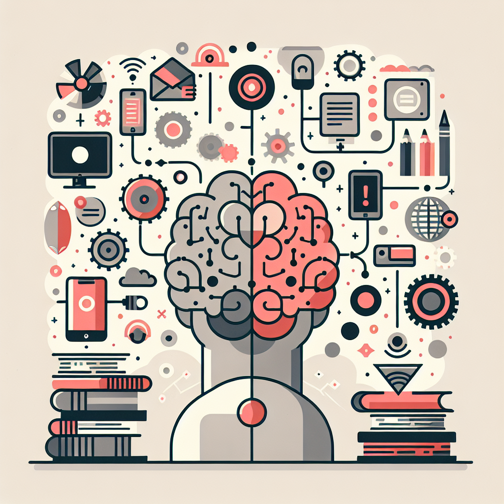
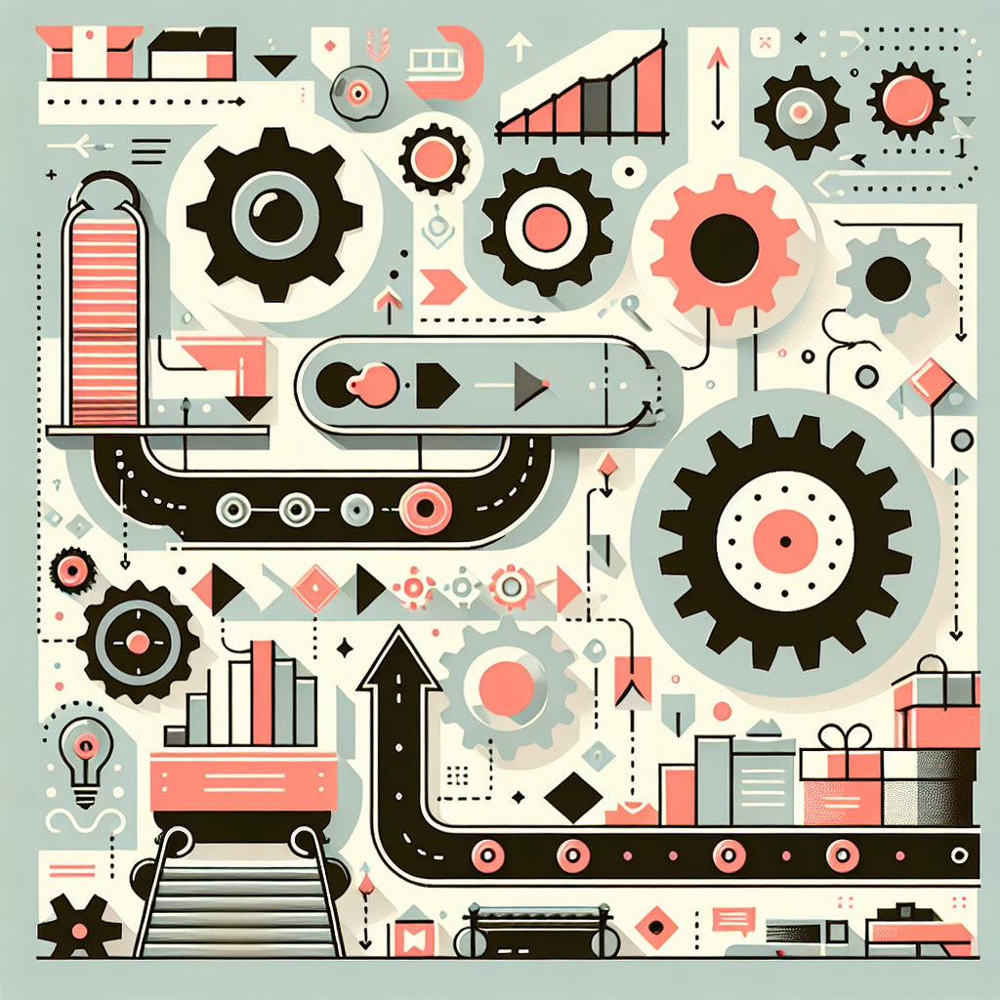
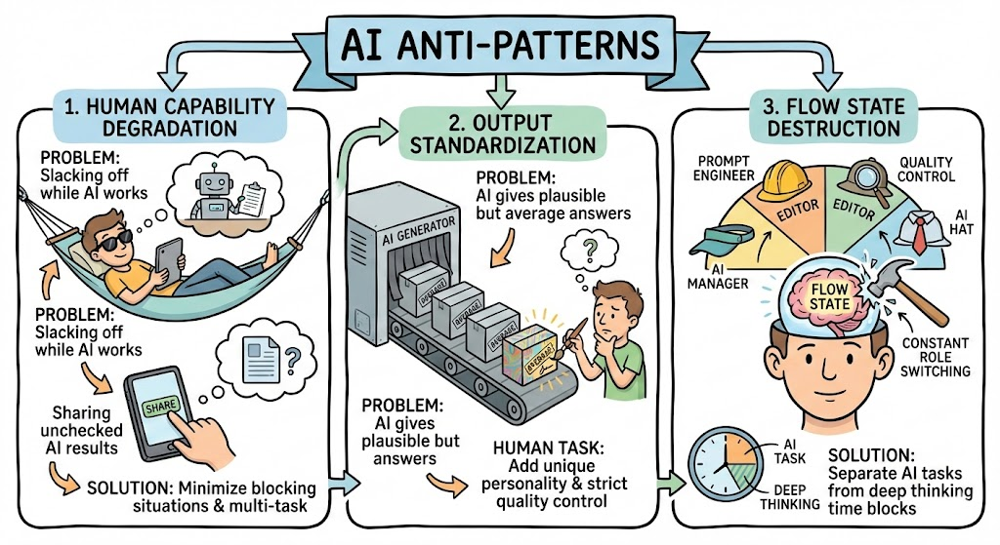

slidenumbers: true

# Using AI for PKM 🤖
## Theory of AI4PKM (2)

^ 안녕하세요. AI4PKM 시리즈의 두 번째 주제, AI를 PKM에 어떻게 활용할 수 있는지에 대해 이야기하겠습니다.

---

# 이전 글 요약 📚

이전 글에서 다룬 내용:

- 지식 관리의 중요성과 4가지 격차
- 정보와 지식의 분류 체계
- PKM의 성공 조건과 안티패턴

**이번 글의 주제**: AI를 활용하는 다양한 단계

^ 지난 시간에는 왜 지식 관리가 필요한지, 그리고 정보와 지식의 분류 체계에 대해 살펴봤습니다. 이번에는 AI를 활용하는 다양한 단계에 대해 구체적으로 알아보겠습니다.

---

# 1. AI 활용 단계의 구분 📊

^ 첫 번째 섹션에서는 AI 활용 수준을 어떻게 구분할 수 있는지 살펴보겠습니다.

---

## AI의 놀라운 능력 ✨

AI는 이미 놀라운 능력을 갖추고 있다:

- 📚 책 몇 권 분량의 컨텍스트를 한번에 처리
- ⚡ 인간이 수십 분 걸리는 작업을 수초 만에 50% 이상 성공
- 🤖 필요에 따라 몇 시간, 며칠도 자율적으로 작업 가능

^ AI는 이미 엄청난 능력을 가지고 있습니다. 책 몇 권 분량의 텍스트를 한번에 이해하고, 사람이 수십 분 걸리는 작업을 단 몇 초 만에 해결합니다. 심지어 필요하다면 며칠 동안 자율적으로 작업을 수행할 수도 있습니다.

---

## 두뇌를 위한 자동차 🚗

> Computer가 "**두뇌를 위한 자전거**"였다면,
> AI는 "**두뇌를 위한 자동차**"다.

하지만 대부분의 사람들은
이 능력의 **10%도 활용하지 못한다**

^ 스티브 잡스는 컴퓨터를 "두뇌를 위한 자전거"라고 표현했습니다. 그렇다면 AI는 "두뇌를 위한 자동차"라고 할 수 있습니다. 하지만 안타깝게도 대부분의 사람들은 이 놀라운 능력의 10퍼센트도 제대로 활용하지 못하고 있습니다.

---

## 5가지 활용 기준 📋

| 기준 | 낮은 수준 | 높은 수준 |
|------|----------|----------|
| **컨텍스트 양** | 수동으로 제한된 정보 | 자동으로 필요한 모든 정보 |
| **결과물의 크기** | 단편적 답변 | 복합적 산출물 |
| **작업의 복잡성** | 단일 질문-응답 | 다단계 워크플로우 |
| **반복 작업** | 매번 수동 실행 | 정기/트리거 기반 자동화 |
| **결과 컨트롤** | AI 출력 복붙 | AI가 직접 파일 생성/수정 |

^ AI 활용 수준은 이 5가지 기준으로 구분할 수 있습니다. 컨텍스트의 양, 결과물의 크기, 작업의 복잡성, 반복 작업의 자동화 수준, 그리고 결과에 대한 컨트롤입니다. 각 기준에서 낮은 수준에서 높은 수준으로 발전할 수 있습니다.

---

## AI 활용 단계 개요 📈

^ 이 다이어그램은 각 AI 활용 단계가 5가지 기준에서 어떤 수준인지 한눈에 보여줍니다. 1단계 ChatGPT에서 5단계 Goal-driven Agents까지, 점점 더 높은 수준으로 발전합니다.

---

# 2. AI 활용 1단계: ChatGPT 💬

가장 익숙한 방식이지만
가장 제한이 많은 활용 방식

^ 이제 각 단계를 자세히 살펴보겠습니다. 첫 번째 단계는 ChatGPT입니다. 가장 많은 사람들이 사용하지만, 사실 가장 제한이 많은 방식이기도 합니다.

---

## ChatGPT의 문제점 ⚠️

| 현재 방식 | 문제점 |
|----------|--------|
| 사람이 AI 도움 영역 판단 | 기회 놓침 |
| 제한된 Context + 수동 프롬프트 | 매번 반복 |
| 결과물 일부만 AI 생성 | 비효율 |
| 사람이 복붙하여 활용 | 수동 작업 |

^ ChatGPT 사용의 문제점을 정리해봤습니다. 사람이 직접 AI 도움이 필요한 영역을 판단하다 보니 많은 기회를 놓칩니다. 매번 컨텍스트를 수동으로 입력해야 하고, 결과물을 일일이 복사해서 붙여넣어야 합니다.

---

## 핵심 한계 💡

- 사람이 "이건 AI한테 시켜볼까?" 판단하는 순간
  → **이미 많은 기회를 놓침**

- AI가 도울 수 있는 영역은 **생각보다 훨씬 넓다**

- **해결책**: AI에게 더 많은 컨텍스트를 제공해야

^ 가장 큰 한계는 사람이 "이건 AI한테 물어볼까?"라고 판단하는 순간 이미 많은 기회를 놓친다는 것입니다. AI가 도울 수 있는 영역은 우리가 생각하는 것보다 훨씬 넓습니다. 이 한계를 극복하려면 AI에게 더 많은 컨텍스트를 제공해야 합니다.

---

# 3. AI 활용 2단계: 컨텍스트 부여 📎

**핵심 아이디어**: AI에게 더 많은 맥락을 제공

^ 2단계의 핵심은 AI에게 더 많은 컨텍스트를 부여하는 것입니다. 이를 통해 더 정확하고 개인화된 답변을 얻을 수 있습니다.

---

## 컨텍스트 제공 도구 🔧

| 도구 | 특성 | 한계 |
|------|------|------|
| **ChatGPT Projects** | 프로젝트별 문맥 제공 | 업로드 용량 제한, 수동 관리 |
| **NotebookLM** | 다수 문서 기반 질의응답 | 소스 타입 제한, 생성물 통제 어려움 |

^ ChatGPT Projects는 프로젝트별로 파일을 업로드해 맥락을 제공할 수 있고, NotebookLM은 여러 문서를 연결해 질의응답할 수 있습니다. 각각 장점이 있지만 한계도 분명합니다.

---

## NotebookLM의 한계 📉

가장 진보적인 NotebookLM도 근본적 한계 존재:

- PDF나 문서 등 **특정 포맷만 지원**
- 이미 추가된 **소스 업데이트 어려움**
- AI 결과물을 **원하는 형태로 저장 불가**
- 질문-응답만 가능, **자동화/워크플로우 불가**

^ NotebookLM은 현재 가장 진보적인 도구 중 하나이지만 근본적인 한계가 있습니다. 특정 포맷만 지원하고, 소스 업데이트가 어렵고, 결과물 저장이 제한적이며, 자동화가 불가능합니다.

---

## 근본적 한계 정리 🔒

컨텍스트 양만 늘어날 뿐:

- ❌ "수동 업로드"의 한계 그대로
- ❌ "복붙"의 한계 그대로

**→ 완전히 다른 접근이 필요하다**

^ 결국 2단계에서는 컨텍스트 양만 늘어날 뿐, 수동 업로드와 복붙이라는 근본적 한계는 그대로입니다. 이를 해결하려면 완전히 다른 접근이 필요합니다.

---

# 4. AI 활용 3단계: 공유 워크스페이스 🏢

"AI가 알아서 컨텍스트를 찾아서 결과물을 만들면 얼마나 좋을까?"

^ 3단계에서는 인간과 AI가 같은 작업 공간을 공유합니다. AI가 필요한 컨텍스트를 알아서 찾고 결과물을 직접 만드는 것입니다.

---

## Human-AI 공유 워크스페이스 🤝

**CLI 에이전트**가 이를 가능하게 한다:
(Claude Code, Gemini CLI 등)

| 특징 | 설명 |
|------|------|
| **파일시스템 접근** | AI가 사용자 파일을 직접 읽고 쓸 수 있음 |
| **자동 컨텍스트 검색** | 작업에 필요한 파일을 AI가 알아서 찾음 |
| **결과물 직접 반영** | 복붙 없이 AI가 바로 파일 생성/수정 |

^ 현재 이를 구현하는 가장 효과적인 방법은 Claude Code나 Gemini CLI 같은 CLI 에이전트입니다. AI가 파일시스템에 직접 접근하고, 필요한 파일을 알아서 찾고, 결과물을 직접 저장합니다.

---

## 1~2단계 문제 해결 ✅

공유 워크스페이스로 해결되는 문제들:

- ✅ AI가 작업에 맞는 파일을 **스스로 찾아** 활용
- ✅ 매번 복붙하는 수고 없이 **직접 파일에 저장**
- ✅ 재사용 가능한 프롬프트로 **반복 작업 간소화**

^ 공유 워크스페이스를 통해 1, 2단계의 핵심 문제들이 해결됩니다. AI가 스스로 파일을 찾고, 결과를 직접 저장하며, 프롬프트를 재사용할 수 있습니다.

---

## 리스크와 해결책 ⚖️

AI와 작업 공간 공유 시 **리스크**:
AI가 파일을 잘못 수정하거나 삭제할 수 있음

| 전략 | 설명 |
|------|------|
| **파일 분리** | 원본과 AI 생성물을 별도 폴더로 관리 |
| **버전 관리** | Git으로 모든 변경사항 추적 |
| **접근 제한** | 중요 파일에 대한 AI 접근 권한 설정 |

^ 물론 AI와 작업 공간을 공유하면 리스크도 따릅니다. AI가 파일을 잘못 수정하거나 삭제할 수 있기 때문입니다. 이를 방지하기 위해 파일 분리, 버전 관리, 접근 제한 같은 전략을 사용합니다.

---

# 5. AI 활용 4단계: Automated Workflows ⚙️

공유 워크스페이스의 다음 진화: **자동화**

^ 4단계는 자동화입니다. 매번 수동으로 실행하지 않고 AI가 알아서 정해진 작업을 수행하는 것입니다.

---

## 워크플로우 유형 📋

| 유형 | 설명 | 예시 |
|------|------|------|
| **Scheduled** | 정해진 시간에 정기 실행 | 매일 아침 컨텐츠 정리 |
| **Triggered** | 이벤트 발생 시 자동 실행 | 새 파일 생성 시 분석 |

^ 워크플로우는 크게 두 가지 유형이 있습니다. Scheduled는 정해진 주기에 실행되고, Triggered는 특정 이벤트가 발생하면 자동으로 실행됩니다.

---

## AI4PKM 핵심 워크플로우 🔄

| 워크플로우 | 주기 | 역할 |
|-----------|------|------|
| **DIR** | 매일 | Daily Ingestion & Roundup |
| **CKU** | 지속 | Continuous Knowledge Upkeep |
| **WRP** | 매주 | Weekly Roundup & Planning |

^ AI4PKM에서 활용하는 핵심 워크플로우들입니다. DIR은 매일 새로 수집된 컨텐츠를 정리하고, CKU는 지속적으로 지식 간 연결을 업데이트하며, WRP는 매주 회고와 계획을 자동 생성합니다.

---

## 자동화의 가치 💎

자동화가 가져오는 핵심 가치:

- ⏰ **일관성**: 매일/매주 빠짐없이 실행
- 🚀 **시간 절약**: 반복 작업에서 해방
- 📈 **품질 향상**: 표준화된 프로세스

하지만 여전히 "**정해진 작업**"만 수행

^ 자동화의 가치는 일관성과 시간 절약, 그리고 품질 향상입니다. 하지만 여전히 미리 정해진 작업만 수행한다는 한계가 있습니다.

---

# 6. AI 활용 5단계: Goal-driven Agents 🎯

목표만 주면 AI가 알아서 계획하고 실행

^ 자동화의 궁극적 진화는 목표 기반 에이전트입니다. 사용자가 고수준 목표만 설정하면 AI가 자율적으로 작업을 계획하고 실행합니다.

---

## Goal-driven Agent 개념 💡

| 요소 | 설명 |
|------|------|
| **목표 정의** | 달성하고자 하는 최종 상태 명시 |
| **자율 실행** | AI가 리서치, 분석, 계획 자동 수행 |
| **피드백 루프** | 중간 결과 보고 → 피드백 → 반복 |

^ Goal-driven Agent는 세 가지 핵심 요소로 구성됩니다. 명확한 목표 정의, AI의 자율적 실행, 그리고 피드백을 통한 지속적 개선입니다.

---

## 필요 요소들 🧩

Goal-driven Agent를 위해 필요한 것:

- 🎯 **고수준 목표**: "Q4 마케팅 전략 수립"
- 🧠 **개인 컨텍스트**: 지식 베이스 + 선호도
- 🛠️ **스킬과 도구**: 프롬프트, 워크플로우
- 🔄 **자율성과 학습**: 피드백 반영, 점진적 개선

^ 이를 위해서는 명확한 고수준 목표, 사용자의 개인 컨텍스트, AI가 활용할 수 있는 스킬과 도구, 그리고 피드백을 반영하는 자율성과 학습 능력이 필요합니다.

---

## 자기 개선 시스템 🌟

Goal-driven Agent의 궁극적 형태:

- 📚 모든 상호작용에서 **학습**
- ⚡ 프롬프트와 워크플로우 **자동 개선**
- 🎨 사용자 선호도에 **지속 적응**

**AI가 단순 실행자에서 목표 달성 파트너로 진화**

^ 궁극적 형태는 자기 개선 시스템입니다. 모든 상호작용에서 학습하고, 프롬프트와 워크플로우를 자동으로 개선하며, 사용자 선호도에 지속적으로 적응합니다. AI가 단순 실행자에서 진정한 목표 달성 파트너로 진화하는 것입니다.

---

# 7. AI 활용의 안티패턴 ⚠️

AI를 활용하는 과정에서
생산성을 **해칠 수 있는** 패턴들

^ 지금까지 AI의 활용 단계를 알아보았습니다. 하지만 AI를 활용하는 과정에서 생산성을 오히려 해칠 수 있는 안티패턴들도 존재합니다.

---

## 안티패턴 다이어그램 📉

^ 이 다이어그램은 AI 활용에서 흔히 나타나는 세 가지 안티패턴을 보여줍니다. 인간의 역량 퇴화, 결과물의 평준화, 그리고 창의적 몰입의 파괴입니다.

---

## 안티패턴 1: 인간의 역량 퇴화 📉

**문제**:
- AI에 일 시켜놓고 딴짓하기
- AI 결과물 제대로 안보고 공유하기

**해결책**:
- 인간이 block되는 상황을 최소화
- 여러 작업을 동시에 진행할 수 있는 환경

^ 첫 번째 안티패턴은 인간의 역량 퇴화입니다. AI에 일을 맡겨놓고 딴짓을 하거나, AI 결과물을 제대로 검토하지 않고 공유하는 경우입니다. 해결책은 인간이 막히는 상황을 최소화하고 여러 작업을 병렬로 진행하는 것입니다.

---

## 안티패턴 2: 결과물의 평준화 😐

**문제**:
- AI는 **그럴듯한 답변**을 내놓음
- 예전에는 중간이었지만, 이제 **최하점**

**해결책**:
- 결과물에 **자신의 개성** 담기
- 자신의 취향에 맞춰 **엄격한 평가**

^ 두 번째 안티패턴은 결과물의 평준화입니다. AI가 만든 그럴듯한 답변은 예전에는 중간 정도였지만, 이제는 모두가 AI를 쓰기 때문에 오히려 최하점이 됩니다. 차별화를 위해 자신의 개성을 담고 엄격하게 평가해야 합니다.

---

## 안티패턴 3: 창의적 몰입의 파괴 🎨

**문제**:
- AI와 작업하면 역할이 계속 바뀜
- 프롬프트 엔지니어 → 편집자 → 품질 관리자 → AI 관리자
- **깊은 몰입 상태(Flow)** 달성이 어려워짐

**해결책**:
- AI 작업과 **깊은 사고 작업을 분리**하여 시간 블록 배정

^ 세 번째 안티패턴은 창의적 몰입의 파괴입니다. AI와 작업하면 역할이 계속 바뀌어 깊은 몰입 상태에 들어가기 어렵습니다. 해결책은 AI 작업과 깊은 사고 작업을 분리하여 별도의 시간 블록을 배정하는 것입니다.

---

# 다음 글에서 👉

"이론은 좋은데, 왜 대부분의 사람들은 PKM에 실패했을까?"

^ 다음 글에서는 AI4PKM 프레임워크에 대해 구체적으로 알아보겠습니다. 실제로 AI를 PKM에 적용하는 방법과 구체적인 실무 사례를 다룰 예정입니다.

---

## 다음 글 예고 📋

- AI 시대 PKM의 **세 가지 결정적 장벽**
- AI가 이 장벽들을 **어떻게 뛰어넘었는지**
- 구체적인 **실무 사례**

^ 다음 글에서는 AI 시대 PKM의 세 가지 결정적 장벽이 무엇인지, AI가 어떻게 이 장벽들을 뛰어넘었는지, 그리고 구체적인 실무 사례를 함께 살펴보겠습니다.

---

# 감사합니다 🙏

## Theory of AI4PKM (2)

^ 시청해 주셔서 감사합니다. 다음 글에서 다시 만나요.
